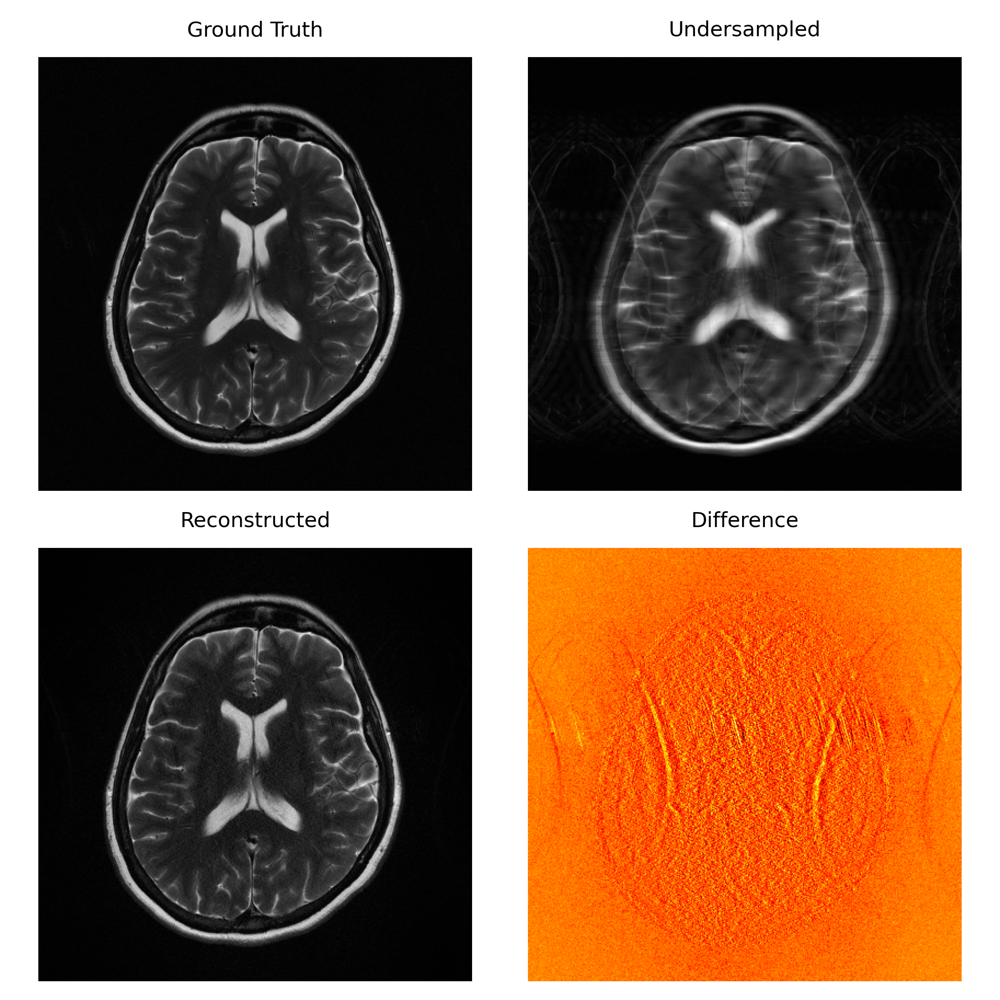

# Fast Implementation of GRAPPA Algorithm
A fast implementation of the **GRAPPA algorithm** for parallel MRI reconstruction, built on **PyTorch**.  
This project leverages GPU acceleration and efficient tensor operations to significantly reduce reconstruction time, making GRAPPA practical as a **preprocessing step in deep learning pipelines**.


## 🚀 Features
- **GPU Acceleration:** PyTorch backend enables massive speedups compared to NumPy-based implementations.  
- **Matrix-Optimized:** Vectorized operations replace Python loops for efficiency.  
- **Fast Pattern Detection:** Unique undersampling patterns identified with optimized tensor operations.  
- **Flexible Integration:** Easily embedded into PyTorch training workflows (e.g., fastMRI, MONAI).  

Typical speedups: **30–40× faster** than CPU-based PyGRAPPA.


## 📦 Installation
To build and install this package locally in **editable mode**, follow these steps:
```bash
pip install build
python -m build
pip intall -e .
```

## 📊 Benchmark
| Method         | Hardware | Avg Runtime (s) | Speedup |
| -------------- | -------- | --------------- | ------- |
| PyGRAPPA (CPU) | i7-8550U | 7.57            | 1×      |
| Proposed (GPU) | MX150    | 0.18            | 42×     |


## 🖼️ Example Reconstruction

Below is an example reconstruction on a T2-weighted brain MRI slice:



*Experimental setup: kernel size = 5×5, number of coils = 20, acceleration factor R = 4, λ = 0.1.*

**Results:**
- PSNR = **35.09 dB**
- SSIM = **0.885**

The reconstructed image closely matches the ground truth, with only minor residuals visible in the difference map.

## 🤝 Contributing
We welcome contributions to improve this implementation further. If you have suggestions, bug reports, or feature requests, please open an issue or submit a pull request.

## 📜 Acknowledgements
This work builds upon the [pygrappa](https://github.com/mckib2/pygrappa) repository by Nicholas McKibben.